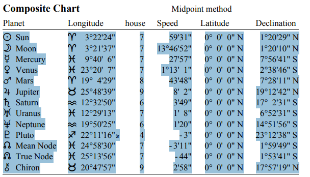
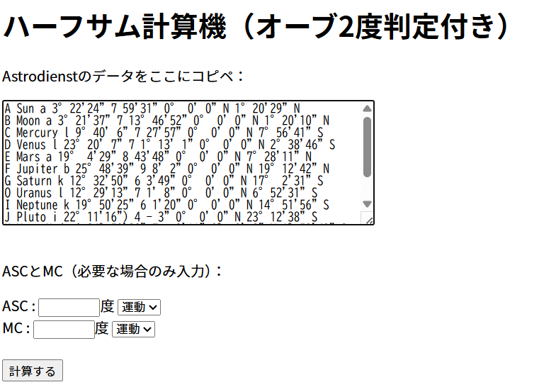
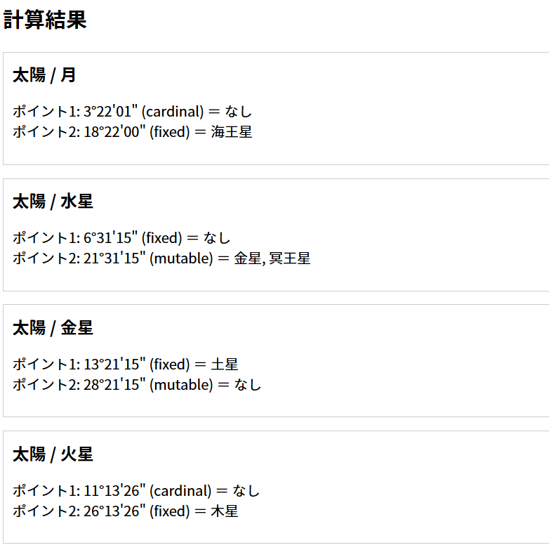

# halfsum-calc

* Astrodienstを使っている方で
* コンポジットチャートでも
* ハーフサムを扱いたい方 向けです。

Astrodienstのコンポジットチャートで

出力されたPDFをコピペするだけで

ハーフサムを計算するアプリを作りました。

## 🔮 ハーフサム作成はこちら（Create）

👉 **[AstrodienstのPDFをコピペするだけでハーフサムを自動計算](https://portfolio.shibuya-yuki.top/app/halfsum-calc/)**

👉 **[アプリの詳細はZennで記事を書いています](https://zenn.dev/gyosei_yuki/articles/38735bfe9f8336)**

## 使用技術 (Tech Stack)

- PHP

## 制作者 (Author)

**渋谷佑生 (Yuki Shibuya)**

- 岩手県で活動する「表現する実務家（行政書士）」
- 音楽配信したり
- 算命学のアプリを配信したり

あまり、行政書士っぽくない活動をしています。
